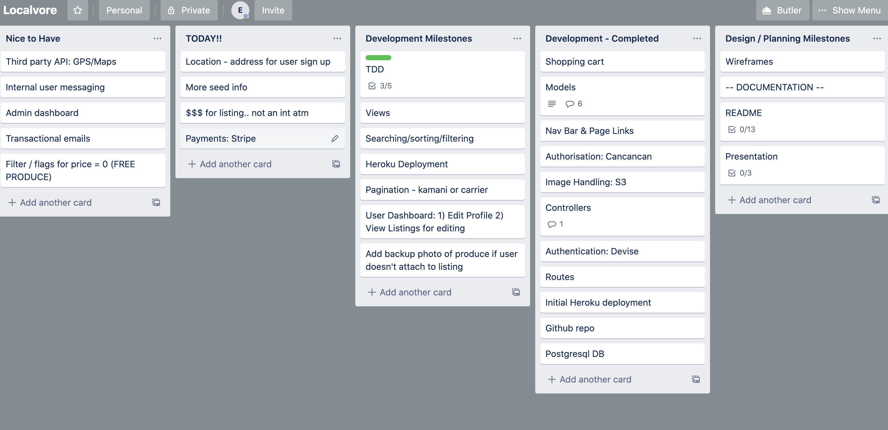
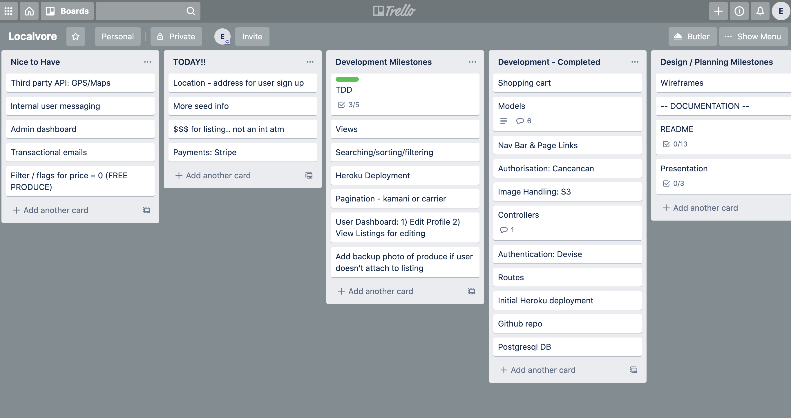
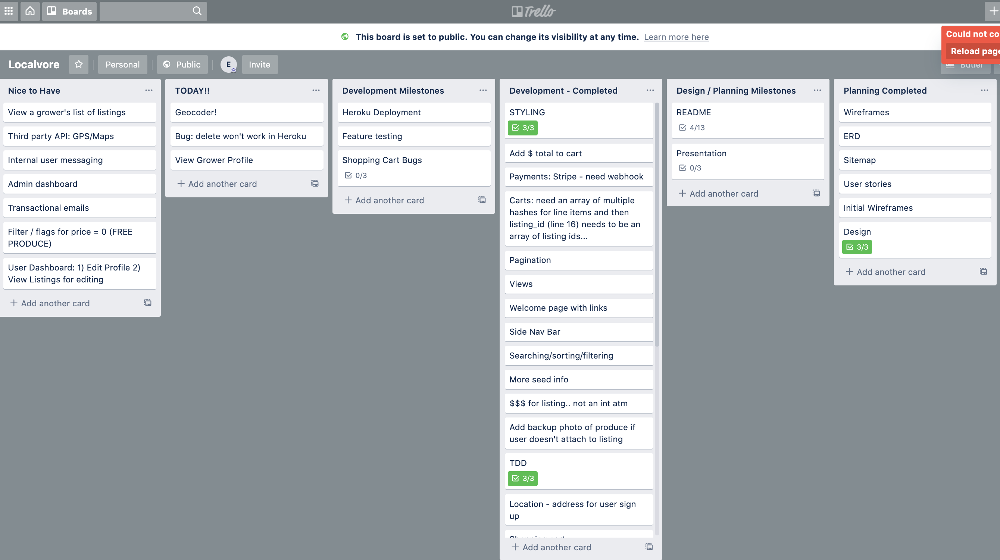
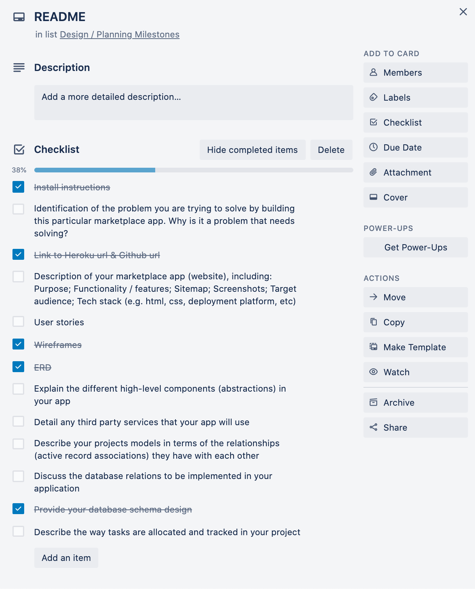
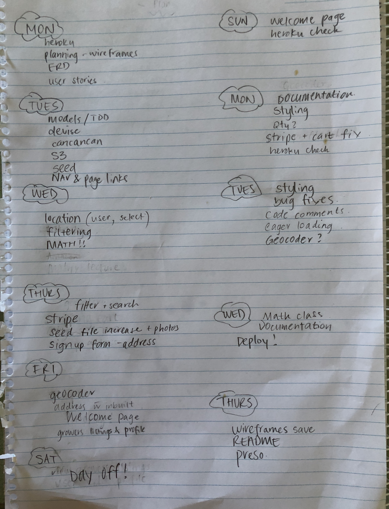

<div style="text-align: justify"> 

--- 

# LocalVore
*“One who eats only locally-grown foods”*

### **LocalVore: the neighbourly fresh produce marketplace.** 

LocalVore is a two-sided marketplace which enables users to find fresh homegrown produce - within bike riding distance from home, and provides a platform for avid gardeners to share their homegrown bounty and connect with their community. 

--- 
## Table of Contents: 

[Links](#links)  
[Setup Instructions & Logins](#setup)  
[Problem](#problem)   
[App Overview](#overview)  
[User Stories](#userstories)  
[Target Audience](#targetaudience)   
[Tech Stack](#techstack)   
[Planning & Project Management](#projectmgnt)   
[Wireframes & Sitemap](#wireframes)  
[ERD & Database Schema Design](#erd)   
[Entity Relationships](#relations)  
[Third Party Services](#thirdparty)  

--- 
<a name="links"/></a>
## Links  

### Heroku: https://radiant-shelf-48298.herokuapp.com/

### GitHub: https://github.com/emmabindi/localvore.git

--- 
<a name="setup"/></a>
## Setup Instructions (Local)

- Clone this repo
- Bundle install to install all required dependencies
- Rake db:setup to create local database migrate and seed
- Enter credentials for Google API & Stripe 
- Rails s to run the rails server
- Load http://localhost:3000/ in the browser

### Logins

Email  | Password |   
| ------------ | :-------|    
| e@gmail.com | `111111` 
| l@gmail.com | `111111`   
| b@gmail.com | `111111`   
| j@gmail.com | `111111`   


---
<a name="problem"/></a>
## Problem & Purpose

LocalVore was created to provide a platform that easily connects home gardeners who have a bounty of fresh produce, with people in their community seeking fresh, local and nutritious produce. 

This platform allows growers to establish a profitable ecosystem for their gardening endeavours, reduces waste and gives those in the community a healthier, more affordable and eco friendly alternative to sourcing their fresh food. 

*LocalVore mission statement:* 

`Building local community, reducing food waste & eating better, for less.`

| **Benefits of LocalVore:** |
| ----------------------------------------------------- |  
| ☑️ Connect people with others in their community   
| ☑️ Reduce food waste   
| ☑️ Reduce packaging    
| ☑️ Access to more affordable fresh produce (cutting out the middle man and supermarkets with high overheads)  
| ☑️ Increased freshness & taste with reduced transit times   
| ☑️ High nutritional value as shorter time from soil to table   
| ☑️ Provide an opportunity for growers to receive income   
| ☑️ Add variety to the foods we eat   
| ☑️ Improve food security   
| ☑️ Help foodies find seasonal food around the corner from their house   
| ☑️ Connects people with nature, seasons and the story of their food  
| ☑️ Reduced ecological footprint with lower emissions 'food miles'   
| ☑️ Secure third party payment system with low transaction fees (Stripe fees < 3%)  
|

### **Market Analysis:** 

Before commencing development I undertook a market analysis to verify the existence and usability of any apps providing the same solution - to buy/sell/swap home grown produce with buyers in your neighbourhood.   

In Australia, I identified several existing platforms however found they did not meet my expectations or have widespread use:  

- **Local Harvest:**   
A non-user friendly website listing locations for visitors to locate farm grown or locally sourced products. These listings are for companies not individuals, therefore does not provide a marketplace for individuals to trade amongst each other

- **Crop Swap:**   
After waiting >5 minutes for the site to load, I found a content heavy website which led me to a page with location links. Unfortunately when I followed the link to join a swap community in my area (Melbourne), it led me to a FaceBook group. This is problemtic for me as a non-Facebook user furthermore use of FaceBook group to post listings does not provide search or filtering functionality nor a secure third party payment method. 


---
<a name="overview"/></a>
## App Overview 

### **Functionality/Features:**
- Sign up to become a member, and login for returning members with authentication provided by Devise 
- Ability for all members to add a new produce listing - specifying a unique title and description, attaching a photo, specifying the price and selecting a unit of measure, category and type  
- Ability to edit profile including biography, profile photo or contact details such as home address   
- Authorisation restrictions which allow guests to view produce and grower profiles however not transact until they have become a member   
- Growers are also able to edit or delete their existing listings  
- Searching & filtering to locate produce with various options including category/subcategory of produce, grower location or keywords such as 'organic'   
- Sorting produce listings by alphabetical order (on title) or price ascending / descending  
- Ability to look up grower profile to view their biography, photo and a summary of their listings   
- Shopping cart functionality which allows buyers to purchase multiple items and complete checkout with secure payment using Stripe   


### **Screenshots:**

`Welcome Page - Guests:`   


`Welcome Page - Member Signed In:`   


`Produce - View All:`   


`Produce - Show:`   


`View Grower Profile:`   


`View Cart:`   


`Payment Checkout - Stripe:`   


`Payment Success - Completed Cart:`   


`Sign Up:`   


`Login:`   


`Add New Listing:`   
  

`Edit Listing:`   
   


--- 
<a name="userstories"/></a>
## User Stories 

### Guest
- As a guest to the marketplace, I want to search for produce, view listings and grower profiles without having to sign up 
- As a guest, I want to sign up securely and become a buyer or sell my produce as a grower (or both) 

### Growers 
- As a grower, I want to create my profile to display information about me and my growing practises and my values
- As a grower looking to sell or share my produce, I want to provide as much detail as possible about my produce including a photo, description, measurement, quantity etc 
- As a grower, I want to set a price for my produce 
- As a grower I want to edit my produce listings to adjust pricing, details or correct errors in the listing 
- As a grower I want to have the ability to delete any of my listings if needed 
- As a grower I want to be able to add a new produce listing without a photo and be able to upload that photo at a later time
- As a grower, I want to receive payment using a secure and cashless gateway, with minimum commission withheld  
- As a grower, I want to organise my listings according to category and type and include keywords in the description for search filtering of features such as 'organic'
- As a grower I want to update my personal profile including profile photo and home address for produce collection 

### Buyers 
- As a buyer, I want to easily find the produce I am searching for using keywords and category filtering
- As a buyer I want to know the distance between myself and the grower to ensure I am within bike riding distance using filtering my location of suburb 
- As a buyer I want to see produce listing locations in a map view to determine if produce is easily accessible for me to collect 
- As a buyer, I want to know the details of the produce including photo, measurement and price
- As a buyer, I want to be able to view the growers profile and get to know their growing procedures 
- As a buyer I want to be able to lookup a particular grower and see a summary of all their listings (so that I can buy as much as possible from one grower) 
- As a buyer, I want to be able to select the item for purchasing and add it to a shopping basket where multiple items can be combined 
- As a buyer I want to be able to pay for my shopping cart securely and complete a transaction 

--- 
<a name="targetaudience"/></a>
## Target Audience


The target audience for LocalVore is adults residing in urban or semi-urban areas with access to internet, who:

As buyers (fit any of the below criteria)
- Are local shopping advocates 
- Seek out fresh, nutritious produce 
- Would like to reduce their carbon footprint by consuming produce with less 'food miles'
- Desire more affordable options to supermarket offerings 
- Would like to meet others in their community and support their gardening endeavours 
- Are limited by a small yard/balcony/lack of sunshine/black thumb or busy schedule and therefore cannot grow all the fresh produce their diet requires 

As growers (fit any of the below criteria)
- Are backyard gardeners and invest time and effort into establishing and maintaining a micro-farm
- Would like to meet others in their community and share the story of how their produce was grown and share their passion 
- Have excess harvest from their crops and do not wish to waste 
- Seek to create a profitable ecosystem from their backyard garden 

---

## Persona's

*(Establishing persona's during planning phase enabled me to step into the shoes of the prospective users of the app and consider their lifestyle, values and needs in order to better develop the app)*

Persona 1: Buyer called 'Jed'
Aged 28, Jed wants to use a simple app to locate a seller & find the produce he is looking for in less than 5 minutes so thhey can purchase organic homegrown produce within bike ride distance of his house rather than giving $ to big supermarkets. Jed is studying a PhD and also works part-time so has very limited time in his schedule to maintain a garden and grow his own produce. Jed also lives in a 2x1 apartment and has just 3sqm of balcony space. 

Persona 2: Seller called 'Jan'
Aged 45, Jan lives on the same street as Jed, but has a larger backyard space and uses it to grow produce. However the bounty from her garden is greater than her household needs. 
Jan seeks to share the excess with neighbours and uses the earnings to reinvest into new gardening tools or seedlings. Jan seeks connection and purpose through gardening and enjoys meeting her customers to share recipe ideas and gardening tips.

--- 
<a name="techstack"/></a>
### Tech Stack 

- Ruby (Ruby on Rails): back end 
- Postgres Database: relational database model
- ERB: Embedded code dynamically rendered into HTML for output
- HTML: content for output 
- Bootstrap CSS Framework: front end design 
- JavaScript: event listener and handler for hovers, map zoom etc
- Heroku: deployment platform 
- Git: version control (>150 commits & 11 branches)

*For a list of third party services including gems implemented in the app, please* [Click Here](#thirdpartydetails)  

--- 
<a name="projectmgnt"/></a>
### Planning & Project Management 

At the commencement of this project, I dedicated an entire day to planning and design. In this stage I decided on the Minimum Viable Product for the project which I believed I could achieve in the given timeframe. I then delegated any features which were not a part of the MVP into a 'Would be Nice' list to create clarity on the tasks required. 

Once I had established my MVP for the app and created user stories, a sitemap and wireframes, I then set milestones according to those feature requirements onto Trello lists. 
As milestones were reached and tasks completed I checked them off within Trello as well as dragging the milestone card to the 'Completed' list. 

I had an overarching outline mapped out by each day within the fortnight (pictured below) and using these timeframe estimates could be comfortable ensuring MVP would be attained well before the delivery date. 

Each day I would commence with reviewing the milestones outstanding, and allocating tasks into my 'Today' list on Trello, matching it off against my hand written outline. At the end of every day I reviewed my progress, marked off any tasks achieved and re-assessed my progress. 

In developing this app, I applied the Agile project management concepts to my approach. In doing this I emphasized building functionality incrementally - in bite size chunks. 
With each new feature implemented, I carried out testing and utilised source control. I would record any bugs as tasks and place them in the backlog. 

`Trello Board - Example 1:`   


`Trello Board - Example 2:`   


`Trello Board - Example 5:`   


`Trello Board - Example 6:`   


`Weekly Timeline Map:`   



--- 
<a name="wireframes"/></a>
## Wireframes & Sitemap

`Site Map:`   


`Mood Board:`  


`Wireframe Welcome Page:`  


`Wireframe Find Produce:`  


`Wireframe View Produce Listing:`  


`Wireframe Add Produce Listing:`  


`Wireframe User Sign Up:`  


--- 
<a name="erd"/></a>
### 8. ERD & Schema Design

`LocalVore ERD:`  


```
Project Marketplace {
  Table users {
    id bigint PK
    first_name string 
    surname string
    email string
    password string
    bio text
    profile_photo string
    location_id int
  }
  
  Table listings {
    id bigint PK
    title string 
    category_id int 
    subcategory_id int 
    uom_id int
    price int 
    quantity int
    photo string
    description text 
    user_id int 
  }
  
  Table category {
    id bigint PK 
    name string
  }
  
  Table subcategory {
    id bigint PK 
    name string
  }
  
  Table unit_of_measurement {
    id bigint PK
    unit string
  }
  
  Table location {
    id bigint PK
    longtitude float
    latitude float
    street_address string
    suburb string
    city string
    state string
    country string
  }
  
  Table carts {
    id bigint PK
    user_id int
    completed boolean
  }
  
  Table cart_listings {
    id bigint PK
    shopping_cart_id int
    listing_id int
  }
}
```

```
Ref: "location"."id" < "users"."location_id"

Ref: "category"."id" < "listings"."category_id"

Ref: "listings"."id" < "cart_listings"."listing_id"

Ref: "carts"."id" < "cart_listings"."shopping_cart_id"

Ref: "users"."id" < "listings"."user_id"

Ref: "subcategory"."id" < "listings"."subcategory_id"

Ref: "users"."id" < "carts"."user_id"

Ref: "unit_of_measurement"."id" < "listings"."uom_id"
```

---
<a name="relations"/></a>
## Entity Relationships & Database Design

### High-Level Components of the App

**1. Active Record**
My Rails app utilised the ActiveRecord Ruby gem which is a Ruby module that provides Object Relational Mapping to the app using inheriance. 
Object Relational Mapping manages the movement of data between objects in the app and the database. It connects all objects to tables within the relational database.
Active Record in Rails represents the 'M' for Model within the 'Model View Controller' pattern. 

ActiveRecord uses ORM to allow the app to create, read, update and destroy data in the database *without* having to write SQL statements directly. It also holds 'built-in' methods under the hood for the C.R.U.D. actions so that less code needs to be written overall. 

These built-in ActiveRecord methods are inherited into each model (which is a database table) within the app which allows CRUD functionality within all tables which are generated. Other built-in methods include Validations which allows the app to validate data according to the stated parameters, before writing it into the database. 

This inheritance is represented by the below: 
1. Application Record << Active Record
  2. 'Custom-App-Models' << Application Record 
Firstly, the Active Record module passes down it's inheritance to the Application Record. From there, the custom models within the app (Eg. Listing) inherits the Active Record functions *through* it's inheritance from the Application Record. 

This inheritance is what allows the app to inherit traits within each model such as the has_many and belongs_to relationships between the various models. 

The Active Record module in Rails with it's built in methods and inheritance, is the reason Rails framework can assist developers to build and deploy full CRUD apps in such a short time-frame and with very little code needing to be written. 

**2. Action Controller**
Another high level component in the app is the Action Controller which is the overarching Controller for all controllers within the app. 

The Action Controller represents the C for Controller in MVC pattern which is the middleman between the model and views. 

The Action Controller holds the classes and methods for handling HTTP requests which come to the app from the client/browser. It receives and responds to requests from the Rails routes. 
These methods instruct the controller to decide what to do with the HTTP requests it's receives (get, put, delete etc). It acts as the middleman to receive the request, then retrieve or insert data from a model then provides HTML output using a view. 

All controllers which are in the app inherit the class characteristics from the Application Controller. (And prior to that, the Application Controller inherits from the Action Controller)

This inheritance is represented by the below: 
1. Application Controller << Action Controller
  2. 'Custom-App-Controller' << Application Controller 

As the Application Controller is the parent of any controllers I created within the app, this is where I have defined authentication methods and set parameters as the HTTP request is first filtered through the Application Controller. 

**3. Action View**
The Action View in Rails represents the V for View within MVC framework. 

The Action View is a framework to handle looking up and rendering of templates, partial templates and layouts. 
 
The Action View contains helper methods which are the Rails magic which handles typical behavious such as Forms. I extensively used the FormHelper methods to create forms and inherited these helper methods very easily through the use of 'form_for' within a HTML form. 

There are three components in Action View which make up the HTML output of the app: 
1. Templates 
  ERB templates are the view templates in Rails which are written with a combination of embedded Ruby code and HTML code. Ruby is embedded (AKA ERB) within templates inside <% %> & <%= %> tags which allowed me to customise views using Ruby code. Templates in Rails end with '.html.erb'
2. Partial Templates (AKA Partials)
  Partials are used to break up code into smaller chunks which are re-used across a number of templates. I used Partials for the navigation bar and also side bar in my app. As this HTML code appeared on several templates in my app I used partials to keep the code dry. 
3. Layouts
  Layouts are used in Rails to hold the common templates which are present globally within the app. Some apps will have the navigation bar as a layout if they wish for it to appear on every single page. 

**4. Active Storage** 
Active Storage is another high level component in my app, it is a built-in Ruby gem which handles file upload & retrieval in the production environment from cloud storage services such as Google or Amazon. 

I utilised Active Storage in the app for the user's profile photos and also listing photo attachments. I chose the image hosting service of AWS S3 which provides secure and scalable storage for files uploaded in my app. The app is configured to work with AWS S3 buckets due to the configuration parameters and through the access key credentials I provided the app from AWS. 

Active Storage uses two tables within my database (blobs and attachments) to handle the files. 
Active_storage_attachments is a polymorphic joining table which stores the corresponding model id along with the record id.
This polymorphic table connects the model with the attachment based on the relationship defined in the model file for example, in my listing model it states 'listing has_one_attached :photo' so the polymorphic joining table will link the photo with the instance of that model which is a listing. The photo is represented in the polymorphic table as a 'blob'.

The second table, active_storage_blobs stores the uploaded file's information (filename, size etc). This is the table which represents the attachments ie. a user's profile photo wouls be one blob or record within this able. 

### Model Relations Within the App  

Below is a list of the core models within my app and an explanation of the relationships they have with each other and why I chose to implement them in this manner. 

Models:
- User
- Listing
- Category
- Subcategory
- Unit of Measurement
- Location 
- Cart 
- Cart_Listings

**User : Listing**
The user model has an active record association to Listing model due to the association that a 'User has_many listings' and a 'Listing belongs_to a User'. This association (or relationship) is implemented within the app by the user_id (User record primary key) being referenced in each and every Listing. This represents a one-to-many association. 

**User : Cart**
The user model also has a relationship with the cart model as a 'User has_many carts' and a 'Cart belongs_to a user'. The user_id (primary key) is referenced in the cart so that every cart will contain a user_id. This is a one-to-many relationship. 

**User : Location**
Another active record association which the user model has is the one-to-one association of 'User has_one location' and 'Location belongs_to a User'. This relationship shows that each location has a user_id (PK) referenced in it. I chose this relationship as I wanted to reflect that every location needed to be associated to a parent which is the User. This is to ensure no location records were stored in the database which were orphaned (without a user) to ensure data integrity by ensuring there are no redundnant records and also that there are no duplications. 

Within the app, I have also utilised the Active Record Method of accepts_nested_attributes_for location within the user model. This allows the location attributes (address details) to be saved through the parent (the user). In the app, this is demostrated by a new location object being created within the creation of a new user (Eg. New member registration form which accepts user attributes including their address which is actually attributes from the child table: location.)

**Listing : Category / Subcategory / U.O.M.**
Listing model has an identical active record association to category/subcategory and unit-of-measurement models. This is because a listing belongs_to a category (and to a subcategory and to a uom). The relationship is represented through the primary key of the category (category_id) being referenced within the listing. 
Each listing can have only one category however a category can be in many different listings (represented through the category has_many listings). 
I implemented these tables and their relationships because I wanted to set in stone the category options available for produce and not have users freehand their inputs while adding produce. 
This ensures data integrity within the database as there is no data duplication or redundancy. For example, if I did not have the category options set and the 'listing belongs_to a category' relationship, users could create the attribute within category for vegetables in many different ways such as: "Vegetables, veggies, vegetables, veg, Veggees, Vegetable" etc

Creating the relationship also allows for searching listings using the attributes from the category/subcategory table attributes which is a key feature of the app.

**Category : Subcategory**
The Category model (which currently stores the main produce categories of Vegetables, Fruit or Herbs) is a parent of the subcategory model. 
(The subcategory model currently stores types of produce within each of the subcategories such as Pumpkin(Vegetable), Apple(Fruit), Coriander(Herb) etc)

Each subcategory belongs to a category through the 'Subcategory belongs_to a Category' and 'Category has_many Subcategories" as I wanted to reflect the dependency between the tables. Ie. the subcategory of 'Coriander' belongs to the category of 'Herbs'. 

I have implemented this parent/child association in preparation, to allow for dynamic filtering within the app so that users can select the category of 'Herbs' and the app will dynamically filter the subcategory dropdown list to only show subcategories with the category of herb, which will narrow the users search. 
(At this stage, the dynamic filtering is in the backlog for implementation in a subsequent release as it requires JavaScript event handling). 

**Cart_Listings : Listings : Cart**
The Cart model has an association to listings using a 'Has Many Through' association type (many-to-many).
This relationship is implemented by a separate joining table Cart_Listings. The cart_listing model signifies an association to both listing and cart models as it belongs_to each. 

A listing 'has_many cart_listings' and 'has_many carts' through cart_listings. This 'has_many through' relationship allows us to access data specific to the relation between the first and second models. It also represents that a listing can be in many different carts. 
The cart model shows the relationship of 'has_many listings through cart_listings'. Which represents that a cart can have multiple listings added to it. 

**Summary**
In summary, I chose to design the database with the above tables and their relations in order to achieve database normalization. 

I wanted to:
- eliminate redundant data 
- reduce complexity of the data 
- create relationship between the tables & data within the tables so I could access attributes through these relationships 
- to setup a logical storage structure for the data 

--- 
<a name="thirdparty"/></a>
<a name="thirdpartydetails"/></a>
## Third Party Services

Functionality has been enhanced through use of third party services (refer to listing below for details)

| Third Party Service  | Purpose & Function                                        | 
| -------------------- | :----------------------------------------- | 
| **Rspec-rails** | Testing tool implemented with the use of behaviour-driven development in the creation of the models within this app (Ruby Gem) 
| **Bootstrap** | HTml, CSS and JavaScript library used to implement styling across the app in particular styling of components such as nav bar, buttons, responsive hamburger menu, card layouts and the footer 
| **Devise** | Authentication solution to implement user accounts. Incorporates user registrations, database authentication with password storage, account recovery (with password resets), tracks user sign ins (timestamps and IP addresses), expires sessions which have been idle and more
| **Cancancan** | Authorization library to restrict the access and resources to users of the app. For example, this Ruby Gem is what allows users to have access to edit or delete their produce listings when it is their own listing however not other users   
| **AWS S3** | Cloud storage of files and images used in and uploaded to the app. This cloud platform supported by Amazon is scalable, reliable and a secure storage method   
| **Stripe** | A payment software platform implemented in the app to provide buyers and growers with a cashless and secure third party service in which to transact. I chose Stripe as they offer low transaction fees
| **Ultrahook** | Provided me with a public webhook endpoint to receive realtime information from Stripe such as confirmation of successful payment through Stripe. This public webhook assisted with me using the real time information from Stripe whilst in the development environment using localhost   
| **Ransack** | A Ruby gem utilised to create simple search forms and filtering to enable users to find produce or filter by location easily  
| **Rails_12factor** | App not able to access jquery_ujs which assist with delete method working in Heroku, also helps in serving static assets in Heroku   
| **Will_Paginate** | Ruby gem to implemented pagination for the listings index - this limits the number of images/listings loaded on the index landing page which will increase efficiency once the listings count is high. Allows user to move through pages with links at the bottom of the listings view and provides page count (... Next)  
| **Sanitize** | Ruby gem which sanitizes html and css inputs (received in from user inputs through fields such as 'title' or 'description' in the add produce listing forms, and strips them of any malicious content) |   
| **Geocoder** | Gem which converts a given address into longitude and langitude co-ordinates and records this against each location. These co-ordinates can then feed into maps to mark locations 
| **GoogleMaps API** | This is the API which Geocoder receives it's geocoding data from and allows Gemcoder to execute the conversion from address to co-ordinates on the fly 
| **MapBox API** | An open source mapping platform to allow map integration within the app (which is displayed through JavaScript)    
| **Leaflet** | Javascript client side library for displaying maps, used to provide a map view of grower locations so buyers can locate produce in a visual way  

``` 
THE END 🌱 Thank you! 
```
---
</div>