<div style="text-align: justify"> 

--- 

# LocalVore
*“One who eats only locally-grown foods”*

### **LocalVore: the neighbourly fresh produce marketplace.** 

LocalVore is a two-sided marketplace which enables users to find fresh homegrown produce - within bike riding distance from home, and provides a platform for avid gardeners to share their homegrown bounty and connect with their community. 

--- 
## Table of Contents: 

[Links](#links)  
[Setup Instructions & Logins](#setup)  
[Problem](#problem)   
[App Overview](#overview)  
[User Stories](#userstories)  
[Target Audience](#targetaudience)   
[Tech Stack](#techstack)   
[Planning & Project Management](#projectmgnt)   
[Wireframes & Sitemap](#wireframes)  
[Entity Relationships](#relations)  
[Entity Relationship Diagram](#erd)   
[Database Schema Design](#schema)  
[App Design Methodology](#methodology)  
[Third Party Services](#thirdparty)  

--- 
<a name="links"/></a>
## Links  

### Heroku: https://git.heroku.com/radiant-shelf-48298.git

### GitHub: https://github.com/emmabindi/localvore.git

--- 
<a name="setup"/></a>
## Setup Instructions  

- Clone this repo
- Bundle install to install all required dependencies
- Rake db:setup to create local database migrate and seed
- Rails s to run the rails server
- Load http://localhost:3000/ in the browser

### Logins

Email  | Password |   
| ------------ | :-------|    
| e@gmail.com | `111111` 
| l@gmail.com | `111111`   
| b@gmail.com | `111111`   
| j@gmail.com | `111111`   


---
<a name="problem"/></a>
## Problem & Purpose

LocalVore was created to provide a platform that easily connects home gardeners who have a bounty of fresh produce, with people in their community wanting fresh, local and nutritious produce. 

This platform allows growers to establish a profitable ecosystem for their gardening endeavours, reduces waste and gives those in the community a healthier, more affordable and eco friendly alternative to sourcing their fresh food. 

*LocalVore mission statement:* 

`Building local community, reducing food waste & eating better, for less.`

**Benefits of LocalVore:** 

☑️ Connect people with others in their community   
☑️ Reduce food waste   
☑️ Reduce packaging    
☑️ Access to more affordable fresh produce (cutting out the middle man and supermarkets with high overheads)  
☑️ Increased freshness & taste with reduced transit times   
☑️ High nutritional value as shorter time from soil to table   
☑️ Provide an opportunity for growers to receive income   
☑️ Add variety to the foods we eat   
☑️ Improve food security   
☑️ Help foodies find seasonal food around the corner from their house   
☑️ Connects people with nature, seasons and the story of their food  
☑️ Reduced ecological footprint with lower emissions 'food miles'   
☑️ Secure third party payment system with low transaction fees (Stripe, fees of <3%)  

**Market Analysis:** 

Before commencing development I undertook a market analysis to verify the existence and usability of any apps providing the same solution - to buy/sell/swap home grown produce with buyers in your neighbourhood.   

In Australia, I identified several existing platforms however found they did not meet my expectations or have widespread use:  

- **Local Harvest:**   
A non-user friendly website listing locations for visitors to locate farm grown or locally sourced products. These listings are for companies not individuals, therefore does not provide a marketplace for individuals to trade amongst each other

- **Crop Swap:**   
After waiting >5 minutes for the site to load, I found a content heavy website which led me to a page with location links. Unfortunately when I followed the link to join a swap community in my area (Melbourne), it led me to a FaceBook group. This is problemtic for me as a non-Facebook user furthermore use of FaceBook group to post listings does not provide search or filtering functionality nor a secure third party payment method. 


---
<a name="overview"/></a>
## App Overview 

**Functionality/Features:**
- Sign up to become a member, and login for returning members with authentication provided by Devise 
- Ability for all members to add a new produce listing - specifying a unique title and description, attaching a photo, specifying the price and selecting a unit of measure, category and type  
- Ability to edit profile including biography, profile photo or contact details such as home address   
- Authorisation restrictions which allow guests to view produce and grower profiles however not transact until they have become a member   
- Growers are also able to edit or delete their existing listings  
- Searching & filtering to locate produce with various options including category/subcategory of produce, grower location or keywords such as 'organic'   
- Sorting produce listings by alphabetical order (on title) or price ascending / descending  
- Ability to look up grower profile to view their biography, photo and a summary of their listings   
- Shopping cart functionality which allows buyers to purchase multiple items and complete checkout with secure payment using Stripe   


**Screenshots:**

`Welcome Page - Guests:`   


`Welcome Page - Member Signed In:`   


`Produce - View All:`   
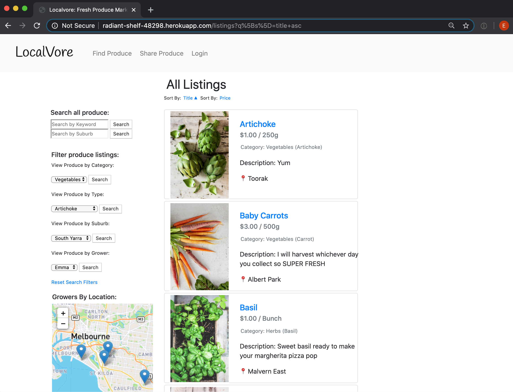

`Produce - Show:`   
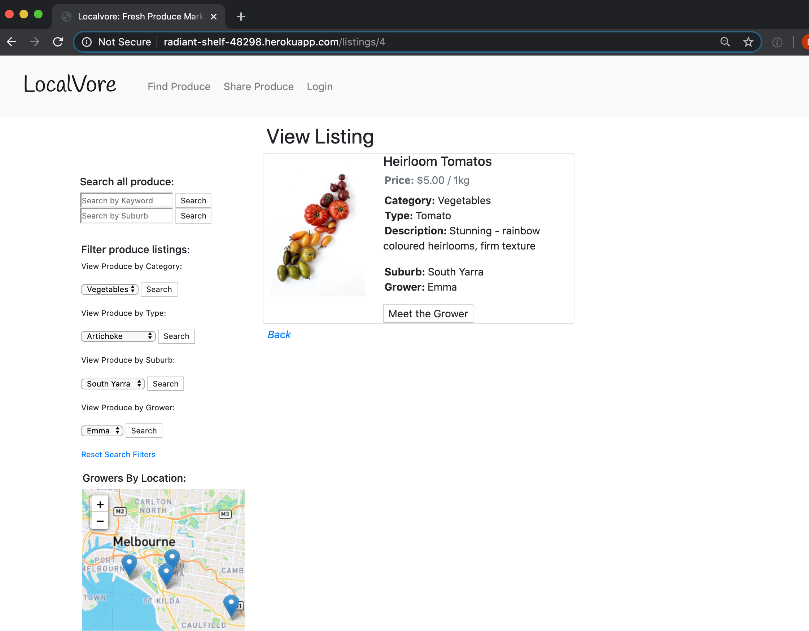

`View Grower Profile:`   
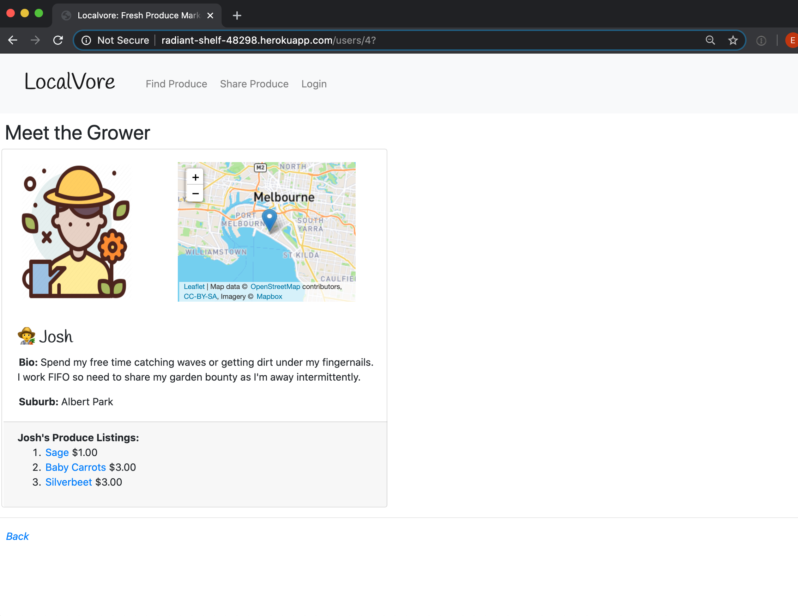

`View Cart:`   
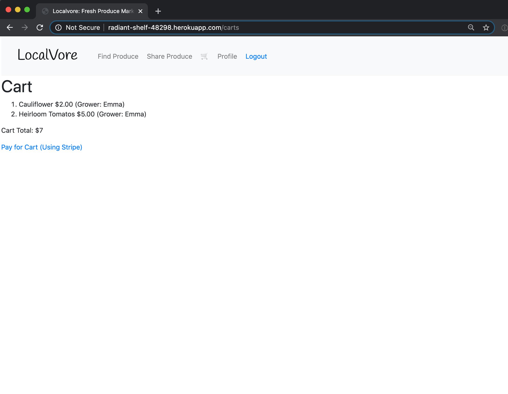

`Payment Checkout - Stripe:`   
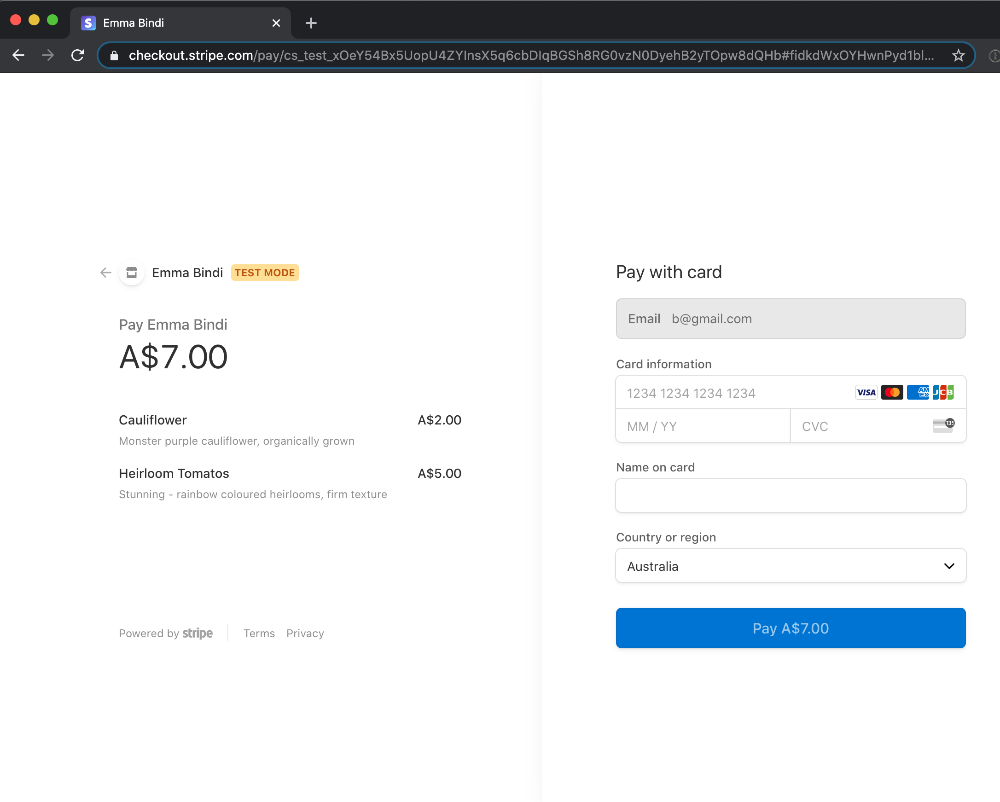

`Payment Success - Completed Cart:`   
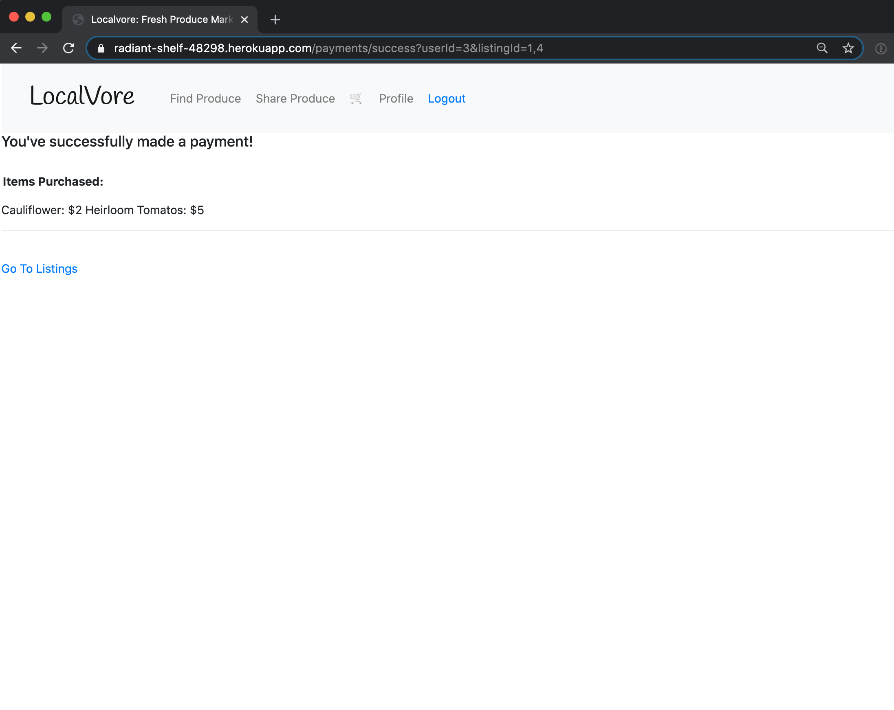

`Sign Up:`   
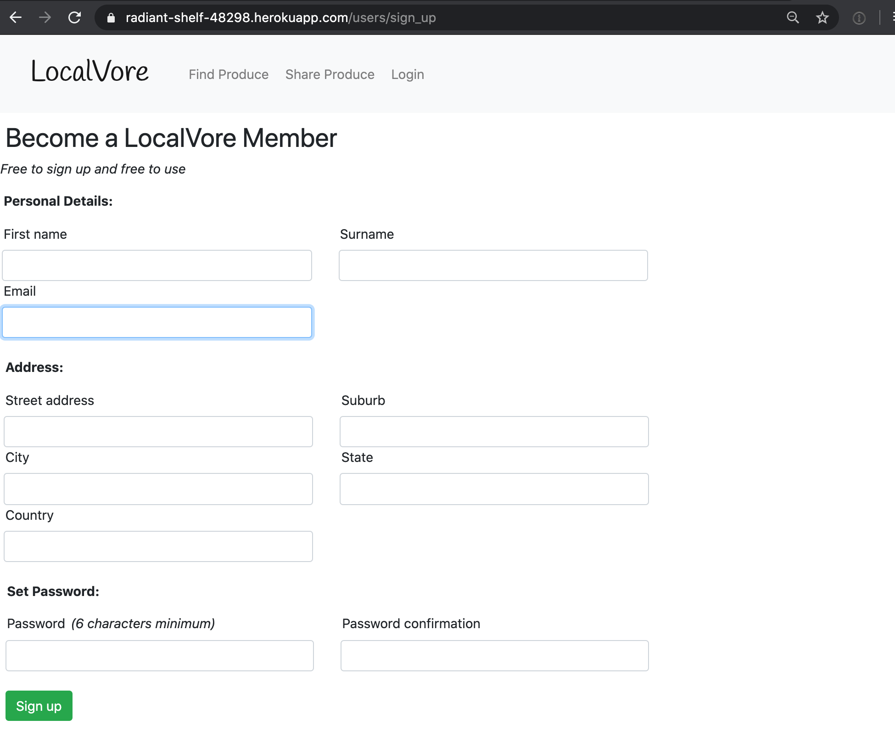

`Login:`   
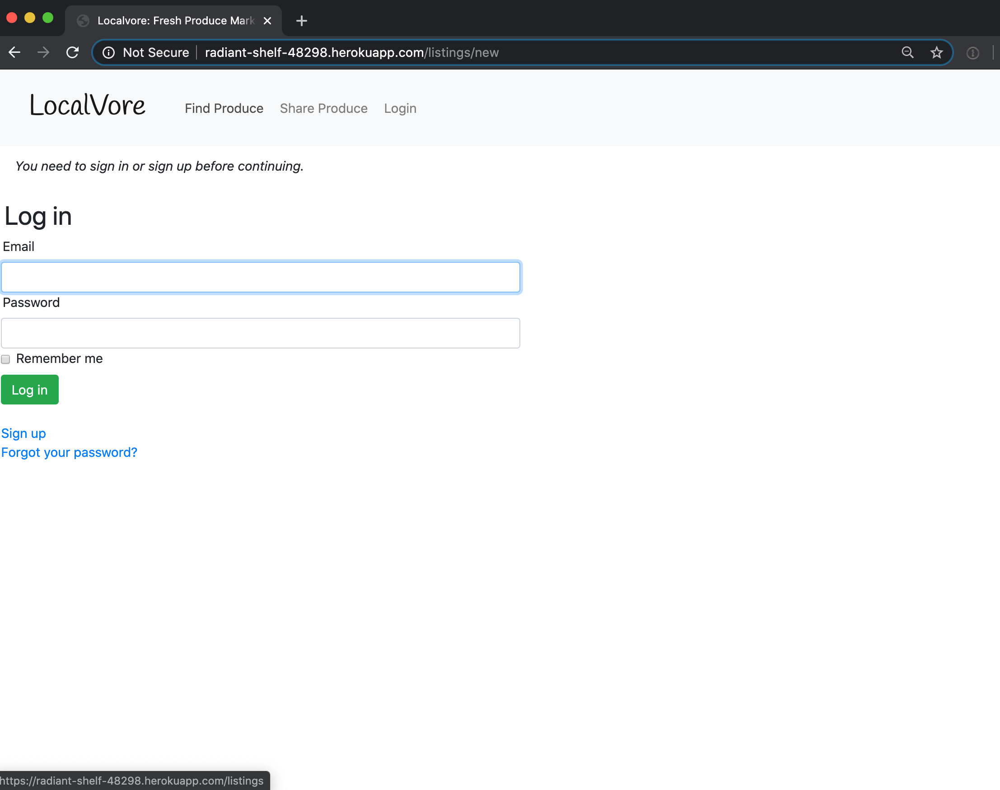

`Update User Profile:`   
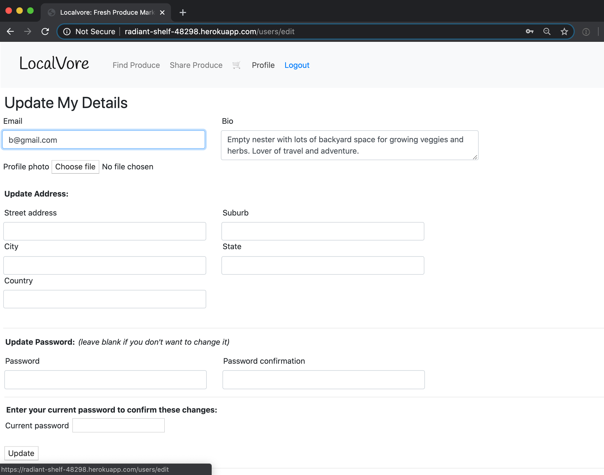

`Add New Listing:`   
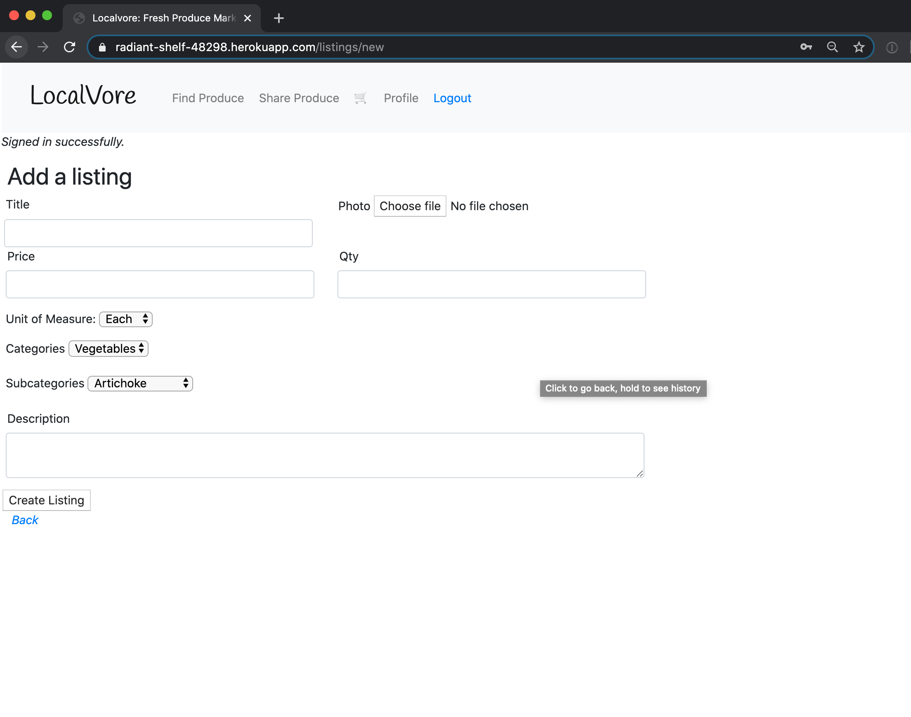  

`Edit Listing:`   
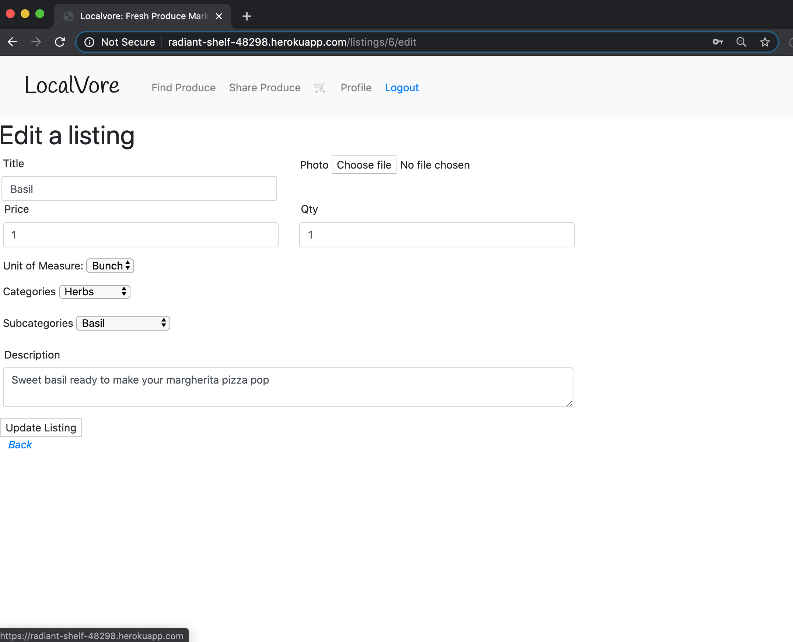   


--- 
<a name="userstories"/></a>
## User Stories 

### Guest
- As a guest to the marketplace, I want to search for produce, view listings and grower profiles without having to sign up 
- As a guest, I want to sign up securely and become a buyer or sell my produce as a grower (or both) 

### Growers 
- As a grower, I want to create my profile to display information about me and my growing practises and my values
- As a grower looking to sell or share my produce, I want to provide as much detail as possible about my produce including a photo, description, measurement, quantity etc 
- As a grower, I want to set a price for my produce 
- As a grower I want to edit my produce listings to adjust pricing, details or correct errors in the listing 
- As a grower I want to have the ability to delete any of my listings if needed 
- As a grower I want to be able to add a new produce listing without a photo and be able to upload that photo at a later time
- As a grower, I want to receive payment using a secure and cashless gateway, with minimum commission withheld  
- As a grower, I want to organise my listings according to category and type and include keywords in the description for search filtering of features such as 'organic'
- As a grower I want to update my personal profile including profile photo and home address for produce collection 

### Buyers 
- As a buyer, I want to easily find the produce I am searching for using keywords and category filtering
- As a buyer I want to know the distance between myself and the grower to ensure I am within bike riding distance using filtering my location of suburb 
- As a buyer I want to see produce listing locations in a map view to determine if produce is easily accessible for me to collect 
- As a buyer, I want to know the details of the produce including photo, measurement and price
- As a buyer, I want to be able to view the growers profile and get to know their growing procedures 
- As a buyer I want to be able to lookup a particular grower and see a summary of all their listings (so that I can buy as much as possible from one grower) 
- As a buyer, I want to be able to select the item for purchasing and add it to a shopping basket where multiple items can be combined 
- As a buyer I want to be able to pay for my shopping cart securely and complete a transaction 

--- 
<a name="targetaudience"/></a>
## Target Audience

```
target aud

Growers: extra yard space, 
Buyers: small yards/balconies/busy schedules/black thumbs 
```

## Persona's

Persona 1 : Buyer 
Aged 25 - 35, wants to use a simple app to locate a seller & find the produce they are looking for in less than 5 minutes so they can purchase organic homegrown produce within bike ride distance of their house rather than giving their $ to big supermarkets 

Persona 2 : Seller 
Aged 35 - 50, has a larger backyard space and uses it to grow produce however bounty is greater than the household needs. Seeks to share or sell the bounty with neighbours to swap for produce they do not grow or receive funds to reinvest into gardening tools or resources. Seeks connection and purpose through gardening and also meeting their customers and sharing recipe ideas and gardening tips

--- 
<a name="techstack"/></a>
### Tech Stack 


```
insert 
```

*For a list of third party services including gems implemented in the app, please* [Click Here](#thirdpartydetails)  


--- 
<a name="projectmgnt"/></a>
### Planning & Project Management 

Describe the way tasks are planned and tracked in your project

MVP   
Trello   
Hand Written   
Tracking / readjusting 


--- 
<a name="wireframes"/></a>
### Wireframes & Sitemap

`Site Map:`   


`Mood Board:`  


`Wireframe Welcome Page:`  


`Wireframe Find Produce:`  


`Wireframe View Produce Listing:`  


`Wireframe Add Produce Listing:`  


`Wireframe User Sign Up:`  


---
<a name="relations"/></a>
### Entity Relationships 


--- 

Explain the different high-level components (abstractions) in your App

it means talking about how your app is using inheritance to get the rails higher level components

for instance your model files are inheriting from ApplicationRecord (Active Record)

so you'd explain how by inheriting from active record you get heaps of extra methods. that then allow you to do CRUD actions on your db


** one example of a higher level comp in my app is Active Record. 
Active Record is a module with the base class inside of it that gives our models methods that allow us to manipulate data . Essentially Active Record can be called on our models to CRUD records. In the background it is executing SQL that does this record manipulation  ** 

There is also: 
Active Controller 
Active View - erb, template/partial/layout differences 
Active Storage - will also be a module that allows me to upload files in a simple manner 
Talk about how active storage can connect to AWS S3 (or other services)

TALK ABOUT 3 


---- 
Describe your project’s models in terms of the relationships (active record associations) they have with each other 

- has many through 


--- 

Discuss the database relations to be implemented
why did i use these tables and relations and how they work

WHY DID YOU USE A MANY TO MANY FOR EG 

--- 

Users: has many listings, has one cart, has one bio, has one profile_photo, has one location, has many conversations?, has many orders 

Listings: belong to a user, has_one_attached :photo, enum (avail/not) has_many cart_listings, has many carts through cart_listings, 
<!-- price / description / keywords / cat / type / qty -->

Quantity: has many listings
Category: has many listings
Type: has many listings

Cart: has many cart_listings, has many listings through cart_listing, belongs to User
Cart_listing (joining table) belongs to listing, belongs to cart

Location: has one address ...  belongs to a user 

Conversations: have many messages, 
Messages - belong to a conversation, belong to a user 
User_conversation - belongs to user, belogns to conversation (JONING TABLE)

<!-- Order: belongs to user, 
OrdersListing join table?  -->

--- 
<a name="erd"/></a>
### 8. ERD 

`LocalVore ERD:`  


```
Project Marketplace {
  Table users {
    id bigint PK
    first_name string 
    surname string
    email string
    password string
    bio text
    profile_photo string
    location_id int
  }
  
  Table listings {
    id bigint PK
    title string 
    category_id int 
    subcategory_id int 
    uom_id int
    price int 
    quantity int
    photo string
    description text 
    user_id int 
  }
  
  Table category {
    id bigint PK 
    name string
  }
  
  Table subcategory {
    id bigint PK 
    name string
  }
  
  Table unit_of_measurement {
    id bigint PK
    unit string
  }
  
  Table location {
    id bigint PK
    longtitude float
    latitude float
    street_address string
    suburb string
    city string
    state string
    country string
  }
  
  Table carts {
    id bigint PK
    user_id int
    completed boolean
  }
  
  Table cart_listings {
    id bigint PK
    shopping_cart_id int
    listing_id int
  }
}


Ref: "location"."id" < "users"."location_id"

Ref: "category"."id" < "listings"."category_id"

Ref: "listings"."id" < "cart_listings"."listing_id"

Ref: "carts"."id" < "cart_listings"."shopping_cart_id"

Ref: "users"."id" < "listings"."user_id"

Ref: "subcategory"."id" < "listings"."subcategory_id"

Ref: "users"."id" < "carts"."user_id"

Ref: "unit_of_measurement"."id" < "listings"."uom_id"
```
--- 
<a name="schema"/></a>
### Database Schema Design 

``` 
  create_table "active_storage_attachments", force: :cascade do |t|
    t.string "name", null: false
    t.string "record_type", null: false
    t.bigint "record_id", null: false
    t.bigint "blob_id", null: false
    t.datetime "created_at", null: false
    t.index ["blob_id"], name: "index_active_storage_attachments_on_blob_id"
    t.index ["record_type", "record_id", "name", "blob_id"], name: "index_active_storage_attachments_uniqueness", unique: true
  end

  create_table "active_storage_blobs", force: :cascade do |t|
    t.string "key", null: false
    t.string "filename", null: false
    t.string "content_type"
    t.text "metadata"
    t.bigint "byte_size", null: false
    t.string "checksum", null: false
    t.datetime "created_at", null: false
    t.index ["key"], name: "index_active_storage_blobs_on_key", unique: true
  end

  create_table "cart_listings", force: :cascade do |t|
    t.bigint "listing_id", null: false
    t.bigint "cart_id", null: false
    t.datetime "created_at", precision: 6, null: false
    t.datetime "updated_at", precision: 6, null: false
    t.index ["cart_id"], name: "index_cart_listings_on_cart_id"
    t.index ["listing_id"], name: "index_cart_listings_on_listing_id"
  end

  create_table "carts", force: :cascade do |t|
    t.boolean "completed"
    t.datetime "created_at", precision: 6, null: false
    t.datetime "updated_at", precision: 6, null: false
    t.bigint "user_id", null: false
    t.index ["user_id"], name: "index_carts_on_user_id"
  end

  create_table "categories", force: :cascade do |t|
    t.string "name"
    t.datetime "created_at", precision: 6, null: false
    t.datetime "updated_at", precision: 6, null: false
  end

  create_table "listings", force: :cascade do |t|
    t.string "title"
    t.string "photo"
    t.integer "price"
    t.integer "qty"
    t.text "description"
    t.datetime "created_at", precision: 6, null: false
    t.datetime "updated_at", precision: 6, null: false
    t.bigint "category_id", null: false
    t.bigint "uom_id", null: false
    t.bigint "user_id", null: false
    t.bigint "subcategory_id", null: false
    t.index ["category_id"], name: "index_listings_on_category_id"
    t.index ["subcategory_id"], name: "index_listings_on_subcategory_id"
    t.index ["uom_id"], name: "index_listings_on_uom_id"
    t.index ["user_id"], name: "index_listings_on_user_id"
  end

  create_table "locations", force: :cascade do |t|
    t.string "street_address"
    t.string "suburb"
    t.string "city"
    t.string "state"
    t.string "country"
    t.float "longitude"
    t.float "latitude"
    t.datetime "created_at", precision: 6, null: false
    t.datetime "updated_at", precision: 6, null: false
    t.bigint "user_id", null: false
    t.index ["user_id"], name: "index_locations_on_user_id"
  end

  create_table "subcategories", force: :cascade do |t|
    t.string "name"
    t.datetime "created_at", precision: 6, null: false
    t.datetime "updated_at", precision: 6, null: false
    t.bigint "category_id"
    t.index ["category_id"], name: "index_subcategories_on_category_id"
  end

  create_table "uoms", force: :cascade do |t|
    t.string "unit"
    t.datetime "created_at", precision: 6, null: false
    t.datetime "updated_at", precision: 6, null: false
  end

  create_table "users", force: :cascade do |t|
    t.string "email", default: "", null: false
    t.string "encrypted_password", default: "", null: false
    t.string "reset_password_token"
    t.datetime "reset_password_sent_at"
    t.datetime "remember_created_at"
    t.datetime "created_at", precision: 6, null: false
    t.datetime "updated_at", precision: 6, null: false
    t.string "first_name"
    t.string "surname"
    t.string "profile_photo"
    t.text "bio"
    t.index ["email"], name: "index_users_on_email", unique: true
    t.index ["reset_password_token"], name: "index_users_on_reset_password_token", unique: true
  end

  add_foreign_key "active_storage_attachments", "active_storage_blobs", column: "blob_id"
  add_foreign_key "cart_listings", "carts"
  add_foreign_key "cart_listings", "listings"
  add_foreign_key "carts", "users"
  add_foreign_key "listings", "categories"
  add_foreign_key "listings", "subcategories"
  add_foreign_key "listings", "uoms"
  add_foreign_key "listings", "users"
  add_foreign_key "locations", "users"
  add_foreign_key "subcategories", "categories"
end

```
--- 
<a name="methodology"/></a>
## App Design Methodology:  

Normalisation through schema design


Data Integrity: sanitize and validate through permitted and required parameters 
validations in the models for length or presence 

Query efficiency through use of includes 

Lazy Loading aachieved through pagination: 

Eager loading 

Git branching 

Postgresql DB 

Testing 

Functionality enhanced through use of third party services (refer to listing below for details)
--- 

--- 
<a name="thirdparty"/></a>
<a name="thirdpartydetails"/></a>
## Third Party Services

| Third Party Service  | Purpose & Function                                        | 
| -------------------- | :----------------------------------------- | 
| **Rspec-rails** | Testing tool implemented with the use of behaviour-driven development in the creation of the models within this app (Ruby Gem) 
| **Bootstrap** | HTml, CSS and JavaScript library used to implement styling across the app in particular styling of components such as nav bar, buttons, responsive hamburger menu, card layouts and the footer 
| **Devise** | Authentication solution to implement user accounts. Incorporates user registrations, database authentication with password storage, account recovery (with password resets), tracks user sign ins (timestamps and IP addresses), expires sessions which have been idle and more
| **Cancancan** | Authorization library to restrict the access and resources to users of the app. For example, this Ruby Gem is what allows users to have access to edit or delete their produce listings when it is their own listing however not other users   
| **AWS S3** | Cloud storage of files and images used in and uploaded to the app. This cloud platform supported by Amazon is scalable, reliable and a secure storage method   
| **Stripe** | A payment software platform implemented in the app to provide buyers and growers with a cashless and secure third party service in which to transact. I chose Stripe as they offer low transaction fees
| **Ultrahook** | Provided me with a public webhook endpoint to receive realtime information from Stripe such as confirmation of successful payment through Stripe. This public webhook assisted with me using the real time information from Stripe whilst in the development environment using localhost   
| **Ransack** | A Ruby gem utilised to create simple search forms and filtering to enable users to find produce or filter by location easily  
| **Rails_12factor** | App not able to access jquery_ujs which assist with delete method working in Heroku, also helps in serving static assets in Heroku   
| **Will_Paginate** | Ruby gem to implemented pagination for the listings index - this limits the number of images/listings loaded on the index landing page which will increase efficiency once the listings count is high. Allows user to move through pages with links at the bottom of the listings view and provides page count (... Next)  
| **Sanitize** | Ruby gem which sanitizes html and css inputs (received in from user inputs through fields such as 'title' or 'description' in the add produce listing forms, and strips them of any malicious content) |   
| **Geocoder** | Gem which converts a given address into longitude and langitude co-ordinates and records this against each location. These co-ordinates can then feed into maps to mark locations 
| **GoogleMaps API** | This is the API which Geocoder receives it's geocoding data from and allows Gemcoder to execute the conversion from address to co-ordinates on the fly 
| **MapBox API** | An open source mapping platform to allow map integration within the app (which is displayed through JavaScript)    
| **Leaflet** | Javascript client side library for displaying maps, used to provide a map view of grower locations so buyers can locate produce in a visual way  

``` 
THE END 🌱 Thank you! 
```
---

PowerPoint Info: 

Learnings / Challenges 
- extensive use of git branching to develop features before merging into master file 
- nested attributes 
- customisation of devise and sanitizer permissions 
- rspec / TDD for models User and Listing
- seeding: attaching individual images to listings 
- using a new gem ransack 
- jquery upgrade broke my hamburger menu 
- cart implementation
- use of Stripe and webhooks for first time (ultrahook api)
- use of Google Maps API, MapBox and Leaflet javascript library - learning to understand and debug new types of errors
- Heroku deployment - database reset and familiarity with new commands 

Points 
- use of partials to ensure code is dry: image-logic partial to handle the conditional treatment of whether photo is uploaded and if not, to display a default sketch image - affects index and show views 
- use of form partial 
- use of nav partial 

Backlog & Optimisations: 
- Qty function 
- Email for order confirmation 
- Messaging within app between growers & buyers
- Shopping Cart bugs: currently sellers can purchase their own produce, items still display once sold, 
- Map: markers to link to the grower profile
- Enable swap function through barter system with tokens rather than currency 
- Enable share of produce for free (no payment transaction but order still processed)
- Allow growers to re-use listings by toggling if the item is available or not available depending on harvest dates
- Allow buyers to view order history 
</div>