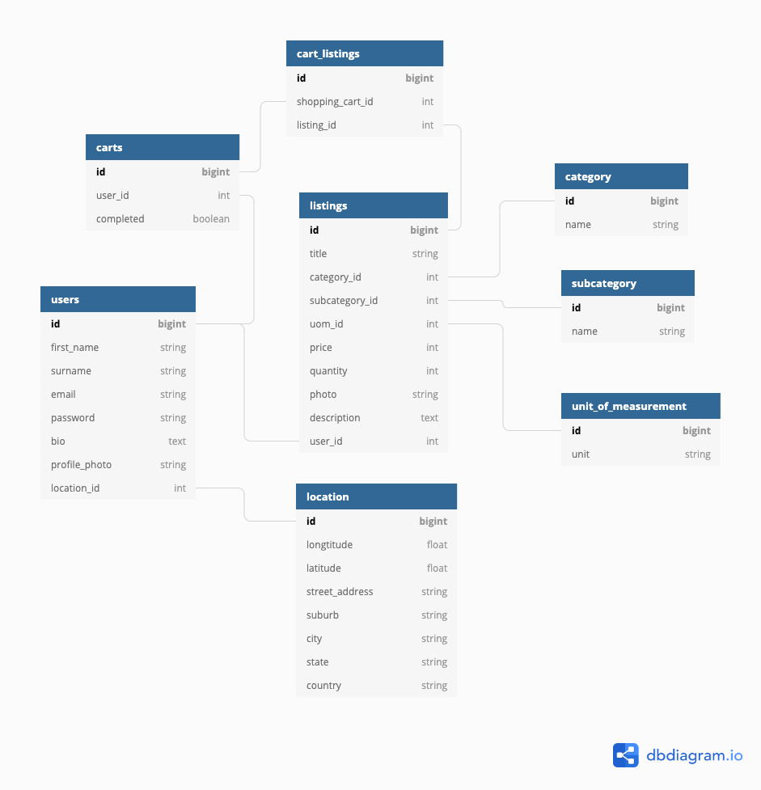

<div style="text-align: justify"> 
--- 
# LocalVore
*“One who eats only locally-grown foods”*

### **LocalVore: the neighbourly fresh produce marketplace.** 

LocalVore is a two-sided marketplace which enables users to find fresh homegrown produce - within bike riding distance from home, and provides a platform for avid gardeners to share their homegrown bounty and connect with their community. 

--- 
## Table of Contents: 

[Links](#links)  
[Setup Instructions & Logins](#setup)
[Problem](#problem) 
[App Overview](#overview)
[User Stories](#userstories)
[Target Audience](#targetaudience) 
[Tech Stack](#techstack) **
[Planning & Project Management](#projectmgnt) 
[Wireframes & Sitemap](#wireframes)
[Entity Relationships](#relations)
[Entity Relationship Diagram](#erd) 
[Database Schema Design](#schema)
[App Design Methodology](#methodology)
[Third Party Services](#thirdparty)

--- 
<a name="links"/></a>
## Links  

### Heroku: https://git.heroku.com/radiant-shelf-48298.git

### GitHub: https://github.com/emmabindi/localvore.git

--- 
<a name="setup"/></a>
## Setup Instructions  

- Clone this repo
- Bundle install to install all required dependencies
- Rake db:setup to create local database migrate and seed
- Rails s to run the rails server
- Load http://localhost:3000/ in the browser

### Logins

Email  | Password |   
------------: | :-------:| ---   

e@gmail.com | `111111` |    
l@gmail.com | `111111` |   
b@gmail.com | `111111` |   
j@gmail.com | `111111` |   


---
<a name="problem"/></a>
## Problem & Purpose

Purpose: Problem I am solving?   

Connecting communities so users can source locally grown fresh produce and growers can share excess produce from their bounty 
Increasing biodiversity (not every grower needs to plant the same as Bob can grow eggplants and Jane can grow tomatos according to their space)
slow food - high nutritional value as little time from soil to table 
Less travel = better eco footprint
More likely organic
Less waste and plastic packaging 
Small yards / little time / different harvest schedules 
Swap without use of money … 

Benefits of LocalVore: 

☑️ Connect communities
☑️ Reduce food waste 
☑️ Access to more affordable fresh produce (cutting out the middle man and supermarkets with high overheads)
☑️ Increased freshness with reduced transit times = tastes better & more nutritious
☑️ Provide an opportunity for growers to receive income 
☑️ Add variety to the foods we eat 
☑️ Improve food security 
☑️ Help foodies find seasonal food around the corner from their house 
☑️ Connects people with nature, seasons and the story of their food
☑️ Reduced ecological footprint with lower emissions 'food miles' 

Market Analysis: 

Before commencing development I undertook a market analysis to verify the existence and usability of any apps providing the same solution - to buy/sell/swap home grown produce. 
In Australia, I identified several existing platforms however found they did not meet my expectations or have widespread use: 
- Local Harvest: a non-user friendly website listing locations for visitors to locate farm grown or locally sourced products. These listings are for companies not individuals, therefore does not provide a marketplace for individuals to trade amongst each other
- Crop Swap: after I waited 10 minutes for the site to load, I found a content heavy website which led me to a page with location links. Unfortunately when I followed the link for my area (Melbourne), to join a swap community, it led me to a FaceBook group. This is problemtic for me as a non-Facebook user furthermore use of FaceBook group to post listings does not provide search or filtering functionality nor a safe third party payment method 


---
<a name="overview"/></a>
## App Overview 

Functionality/Features:

Screenshots: 


--- 
<a name="userstories"/></a>
## User Stories 

### Guest
- As a guest to the marketplace, I want to search products, view listings and growers without having to sign up 
- As a guest, I want to sign up securely and become a buyer or sell my produce as a grower (or both) 

### Growers 
- As a grower, I want to create my profile to display information about me and my growing practises and also share my values 
- As a grower looking to sell or share my produce, I want to share as much detail about my produce such as photos, description, quantity etc 
- As a grower, I want to be paid by cash or through my bank account or share my bounty for free 
- As a grower, I want to organise my listings according to category and type and include filters for features such as organically grown items 
- As a grower, I want to set a price for my produce 
- As a grower, I want to answer questions about my produce by allowing buyers to message me 
<!-- - As a grower I want to be able to re-use listings and toggle if the item is available or not available depending on harvest days  -->
- As a grower I want to view my sales history 

### Buyers 
- As a buyer, I want to easily find the produce I am searching for using keywords and category filtering
- As a buyer I want to know the distance between myself and the grower to ensure I am within bike riding distance  FILTER BY LOCATION 
- As a buyer, I want to know the details of the produce 
- As a buyer, I want to be able to view the growers profile and get to know their growing procedures 
- As a buyer, I want to be able to select the item for purchasing including the quantity needed and add it to a shopping basket
- As a buyer I want to be able to view produce listings of a grower (so that I can buy as much as possible from one grower) FILTER BY GROWER
- As a buyer I want to be able to message a seller and offer trade or arrange pickup 
- As a buyer I want to be able to pay for my shopping cart and complete a transaction 
- As a buyer I want to see my order history 


```fix
option to settle a shopping cart by trade / swap instead of 
```

--- 
<a name="targetaudience"/></a>
## Target Audience

```
target aud
```

## Persona's

Persona 1 : Buyer 
Aged 25 - 35, wants to use a simple app to locate a seller & find the produce they are looking for in less than 5 minutes so they can purchase organic homegrown produce within bike ride distance of their house rather than giving their $ to big supermarkets 

Persona 2 : Seller 
Aged 35 - 50, has a larger backyard space and uses it to grow produce however bounty is greater than the household needs. Seeks to share or sell the bounty with neighbours to swap for produce they do not grow or receive funds to reinvest into gardening tools or resources. Seeks connection and purpose through gardening and also meeting their customers and sharing recipe ideas and gardening tips

--- 
<a name="techstack"/></a>
### Tech Stack 


```
insert 
```

--- 
<a name="projectmgnt"/></a>
### Planning & Project Management 

Describe the way tasks are planned and tracked in your project

MVP   
Trello   
Hand Written   
Tracking / readjusting 


--- 
<a name="wireframes"/></a>
### Wireframes & Sitemap

`Site Map:`   


`Mood Board:`  


`Wireframe Welcome Page:`  


`Wireframe Find Produce:`  


`Wireframe View Produce Listing:`  


`Wireframe Add Produce Listing:`  


`Wireframe User Sign Up:`  


---
<a name="relations"/></a>
### Entity Relationships 


--- 

Explain the different high-level components (abstractions) in your App

it means talking about how your app is using inheritance to get the rails higher level components

for instance your model files are inheriting from ApplicationRecord (Active Record)

so you'd explain how by inheriting from active record you get heaps of extra methods

that then allow you to do CRUD actions on your db

you could also talk about ApplicationController
or talk about erb


---- 
Describe your project’s models in terms of the relationships (active record associations) they have with each other 

--- 

Discuss the database relations to be implemented

--- 

Users: has many listings, has one cart, has one bio, has one profile_photo, has one location, has many conversations?, has many orders 

Listings: belong to a user, has_one_attached :photo, enum (avail/not) has_many cart_listings, has many carts through cart_listings, 
<!-- price / description / keywords / cat / type / qty -->

Quantity: has many listings
Category: has many listings
Type: has many listings

Cart: has many cart_listings, has many listings through cart_listing, belongs to User
Cart_listing (joining table) belongs to listing, belongs to cart

Location: has one address ...  belongs to a user 

Conversations: have many messages, 
Messages - belong to a conversation, belong to a user 
User_conversation - belongs to user, belogns to conversation (JONING TABLE)

<!-- Order: belongs to user, 
OrdersListing join table?  -->

--- 
<a name="erd"/></a>
### 8. ERD 

`LocalVore ERD:`  


--- 
<a name="schema"/></a>
### Database Schema Design 

``` 
  create_table "active_storage_attachments", force: :cascade do |t|
    t.string "name", null: false
    t.string "record_type", null: false
    t.bigint "record_id", null: false
    t.bigint "blob_id", null: false
    t.datetime "created_at", null: false
    t.index ["blob_id"], name: "index_active_storage_attachments_on_blob_id"
    t.index ["record_type", "record_id", "name", "blob_id"], name: "index_active_storage_attachments_uniqueness", unique: true
  end

  create_table "active_storage_blobs", force: :cascade do |t|
    t.string "key", null: false
    t.string "filename", null: false
    t.string "content_type"
    t.text "metadata"
    t.bigint "byte_size", null: false
    t.string "checksum", null: false
    t.datetime "created_at", null: false
    t.index ["key"], name: "index_active_storage_blobs_on_key", unique: true
  end

  create_table "cart_listings", force: :cascade do |t|
    t.bigint "listing_id", null: false
    t.bigint "cart_id", null: false
    t.datetime "created_at", precision: 6, null: false
    t.datetime "updated_at", precision: 6, null: false
    t.index ["cart_id"], name: "index_cart_listings_on_cart_id"
    t.index ["listing_id"], name: "index_cart_listings_on_listing_id"
  end

  create_table "carts", force: :cascade do |t|
    t.boolean "completed"
    t.datetime "created_at", precision: 6, null: false
    t.datetime "updated_at", precision: 6, null: false
    t.bigint "user_id", null: false
    t.index ["user_id"], name: "index_carts_on_user_id"
  end

  create_table "categories", force: :cascade do |t|
    t.string "name"
    t.datetime "created_at", precision: 6, null: false
    t.datetime "updated_at", precision: 6, null: false
  end

  create_table "listings", force: :cascade do |t|
    t.string "title"
    t.string "photo"
    t.integer "price"
    t.integer "qty"
    t.text "description"
    t.datetime "created_at", precision: 6, null: false
    t.datetime "updated_at", precision: 6, null: false
    t.bigint "category_id", null: false
    t.bigint "uom_id", null: false
    t.bigint "user_id", null: false
    t.bigint "subcategory_id", null: false
    t.index ["category_id"], name: "index_listings_on_category_id"
    t.index ["subcategory_id"], name: "index_listings_on_subcategory_id"
    t.index ["uom_id"], name: "index_listings_on_uom_id"
    t.index ["user_id"], name: "index_listings_on_user_id"
  end

  create_table "locations", force: :cascade do |t|
    t.string "street_address"
    t.string "suburb"
    t.string "city"
    t.string "state"
    t.string "country"
    t.float "longitude"
    t.float "latitude"
    t.datetime "created_at", precision: 6, null: false
    t.datetime "updated_at", precision: 6, null: false
    t.bigint "user_id", null: false
    t.index ["user_id"], name: "index_locations_on_user_id"
  end

  create_table "subcategories", force: :cascade do |t|
    t.string "name"
    t.datetime "created_at", precision: 6, null: false
    t.datetime "updated_at", precision: 6, null: false
    t.bigint "category_id"
    t.index ["category_id"], name: "index_subcategories_on_category_id"
  end

  create_table "uoms", force: :cascade do |t|
    t.string "unit"
    t.datetime "created_at", precision: 6, null: false
    t.datetime "updated_at", precision: 6, null: false
  end

  create_table "users", force: :cascade do |t|
    t.string "email", default: "", null: false
    t.string "encrypted_password", default: "", null: false
    t.string "reset_password_token"
    t.datetime "reset_password_sent_at"
    t.datetime "remember_created_at"
    t.datetime "created_at", precision: 6, null: false
    t.datetime "updated_at", precision: 6, null: false
    t.string "first_name"
    t.string "surname"
    t.string "profile_photo"
    t.text "bio"
    t.index ["email"], name: "index_users_on_email", unique: true
    t.index ["reset_password_token"], name: "index_users_on_reset_password_token", unique: true
  end

  add_foreign_key "active_storage_attachments", "active_storage_blobs", column: "blob_id"
  add_foreign_key "cart_listings", "carts"
  add_foreign_key "cart_listings", "listings"
  add_foreign_key "carts", "users"
  add_foreign_key "listings", "categories"
  add_foreign_key "listings", "subcategories"
  add_foreign_key "listings", "uoms"
  add_foreign_key "listings", "users"
  add_foreign_key "locations", "users"
  add_foreign_key "subcategories", "categories"
end

```
--- 
<a name="methodology"/></a>
## App Design Methodology:  

Normalisation through schema design


Data Integrity: sanitize and validate through permitted and required parameters 
validations in the models for length or presence 

Query efficiency through use of includes 

Lazy Loading aachieved through pagination: 

Eager loading 

Git branching 

Postgresql DB 

Testing 

Functionality enhanced through use of third party services (refer to listing below for details)
--- 

--- 
<a name="thirdparty"/></a>
## Third Party Services

3rd Party Service  |  | 
------------------ | :--------------------------------------------------: | :-------
**Rspec-rails** | Testing tool implmeneted with the use of behaviour-driven development in the creation of the models within this app (Ruby Gem) | 
**Bootstrap** | HTml, CSS and JavaScript library used to implement styling across the app in particular styling of components such as nav bar, buttons, responsive hamburger menu, card layouts and the footer | 
**Devise** | Authentication solution to implement user accounts. Incorporates user registrations, database authentication with password storage, account recovery (with password resets), tracks user sign ins (timestamps and IP addresses), expires sessions which have been idle and more. |
**Cancancan** | Authorization library to restrict the access and resources to users of the app. For example, this Ruby Gem is what allows users to have access to edit or delete their produce listings when it is their own listing however not other users. | 
**Stripe** | What id it, Why did I use it | 
**Ultrahook** | What id it, Why did I use it | 
**Ransack** | What id it, Why did I use it | 
**Rails_12factor** | App not able to access jquery_ujs which assist with delete method working in Heroku, also helps in serving static assets in Heroku | 
**Will_Paginate** | Ruby gem to implemented pagination for the listings index - this limits the number of images/listings loaded on the index landing page which will increase efficiency once the listings count is high. Allows user to move through pages with links at the bottom of the listings view and provides page count (... Next) | 
**Geocoder** | Gem | 
**Leaflet** | Javascript client side library for displaying maps | 
**Sanitize** | Ruby gem which sanitizes html and css inputs (received in from user inputs through fields such as 'title' or 'description' in the add produce listing forms, and strips them of any malicious content) | 


---

PowerPoint Info: 

Learnings / Challenges 
- extensive use of git branching to develop features before merging into master file 
- nested attributes 
- customisation of devise and sanitizer permissions 
- rspec / TDD for models User and Listing
- seeding: attaching individual images to listings 
- using a new gem ransack 
- jquery upgrade broke my hamburger menu 
- cart implementation
- use of Stripe and webhooks for first time (ultrahook api)
- use of Google Maps API, MapBox and Leaflet javascript library - learning to understand and debug new types of errors
- Heroku deployment - database reset and familiarity with new commands 

Points 
- use of partials to ensure code is dry: image-logic partial to handle the conditional treatment of whether photo is uploaded and if not, to display a default sketch image - affects index and show views 
- use of form partial 
- use of nav partial 

Backlog & Optimisations: 
- Qty function 
- Email for order confirmation 
- Messaging within app between growers & buyers
- Shopping Cart bugs: currently sellers can purchase their own produce, items still display once sold, 
- Map: markers to link to the grower profile
- Enable swap function through barter system with tokens rather than currency 

</div>